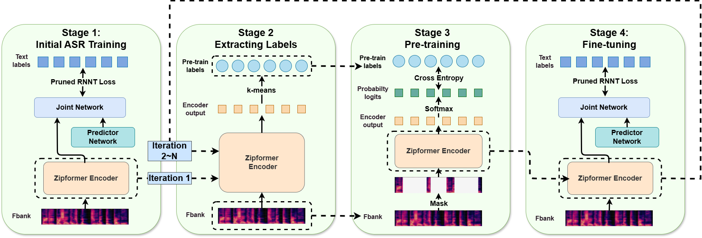

# VietASR

This repository contains the training code for VietASR.

## Overview
VietASR is a training pipeline designed for low resource ASR. It uses ASR-biased SSL to pretrain strong speech encoder with limited labeled data and large-scale unlabeled data. The training pipeline of VietASR consists of 4 stages: initial ASR training, extracting labels, pretraining and finetuning.


## Environment
 This repo relies on [lhotse](https://github.com/lhotse-speech/lhotse) for data pretreatment and uses [icefall](https://github.com/k2-fsa/icefall) as framework. For the steps to install these two dependencies, please refer to [icefall install tutorial](https://k2-fsa.github.io/icefall/installation/index.html). Make sure to run the following command in you terminal before running any script in this repo. When you run this command, the icefall_path should be replaced with the path to you icefall repository.
 ```bash
 export PYTHONPATH=icefall_path:$PYTHONPATH
 ```
 

## Data preparation
### Unsupervised data preparation

We use [funASR](https://huggingface.co/funasr/fsmn-vad) to do VAD for unsupervised data. Check [vad.py](SSL/local/vad.py) for an example script.

Then we extract fbank feature from unsupervised audio segment. The segmented audio should be in .wav form, and stored under ```SSL/download/ssl_${subset_name}```. Please update the   ```subset_name``` in ```./SSL/prepare_ssl.sh``` to match you data organization. And then run the following command. Make sure that you have a subset called dev, and subset_name for every subset used as training subset should starts with "train"
```bash
cd SSL
./prepare_ssl.sh
```
Once the execution is complete, a new directory will be created at  ```SSL/data/ssl_${subuset_name}/{subset_name}_split``` which stores the manifest of unsupervised data.
Check [SSL/prepare_ssl.sh](SSL/prepare_ssl.sh) for details.
### Supervised data preparation
Put you supervised data under ```download/supervised```. The audio should be in .wav form, and the data structure should be like
```
download
├───train
|   ├───data1
|   |   ├───*.wav
|   |   └───filename.trans.txt
|   └───...
├───test
|   └───...
└───dev
    └───...
```
The filename.trans.txt should contains the text label for the ```.wav```file in the directory, like the following structure:
```
audio_filename_without_suffix_1 text_label_1
audio_filename_without_suffix_2 text_label_2
```
And then run
```bash
cd ASR
./prepare.sh
```

## Initial ASR model
The training process of VietASR starts from training an ASR model with a small amount of labeled data.
```bash
cd ASR
./scipts/train.sh
```

## Train k-means model
We will train the kmeans model on a small cut (about 100h hours, you can build it with the gzip library of python) of the unsupervised manifest. Set the ```--files``` in ```SSL/scripts/learn_fbank_kmeans.sh``` to the train cut path. For the first iteration of pretraining, the k-means is apply on ASR model trained on supervised data, show you should set the ```--checkpoint-type``` to be ```ASR``` in the script, and ```finetune``` for other iterations. And then run

```bash
cd SSL
./scripts/learn_vietASR_kmeans.sh
```

Check [learn_vietASR_kmeans.sh](SSL/scripts/learn_vietASR_kmeans.sh) for details


## Extracting labels

This part will extract k-means from source cuts and save to test cut, assume the source cuts paths and the target cuts paths are stored in a file(```--task-list``` in the script) in the following form:
```
src_cut_path1 target_cut_path1
src_cut_path2 target_cut_path2
...
```
src_cut_path is the path for unsupervised manifest, for example, ```data/ssl_data/data_split/vietASR-ssl_cuts_data.00000001.jsonl.gz```, and for target path, an extra label type is necessary to distinguish label of different iterations, so the target_cut_path should be like ```data/ssl_data/data_split/vietASR-ssl_cuts_data_iter1.00000001.jsonl.gz```

Modified ```SSL/scripts/extract_vietASR_kmeans.sh```, and then run
```bash
cd SSL
./scripts/extract_vietASR_kmeans.sh
```
Check [extract_vietASR_kmeans.sh](SSL/scripts/extract_vietASR_kmeans.sh) for details

## Pretrain
To run pretraining, update the parameter follows the instruction in ```SSL/scripts/run_ssl.sh``` and run
```bash
cd SSL
./scripts/run_ssl.sh
```
## Finetune
To finetune the pretrained model, update the parameter follows the instruction in ```SSL/scripts/finetune_tri_stage.sh``` and run
```bash
cd SSL
./scripts/finetune_tri_stage.sh
```
## Decode
To run evaluation, update the parameter follows the instruction in ```SSL/scripts/decode.sh``` and run
```bash
cd SSL
./scripts/decode.sh $epoch $avg $gpu_id
```
Here args for the command means the checkpoint of ```$epoch``` is evaluated, with a model average on ```$avg``` epoch, using the GPU ```$gpu_id```
